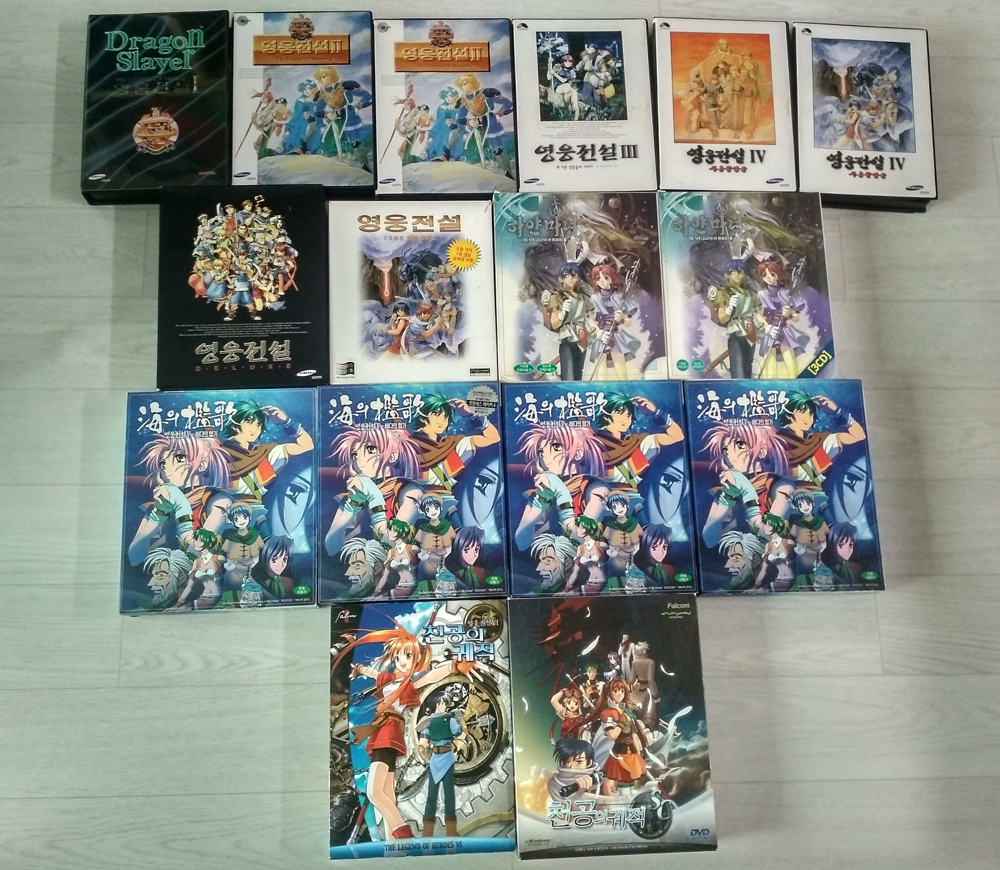
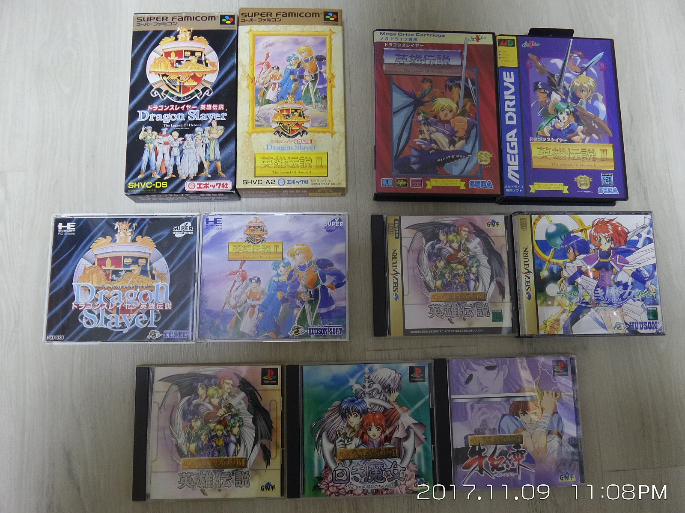
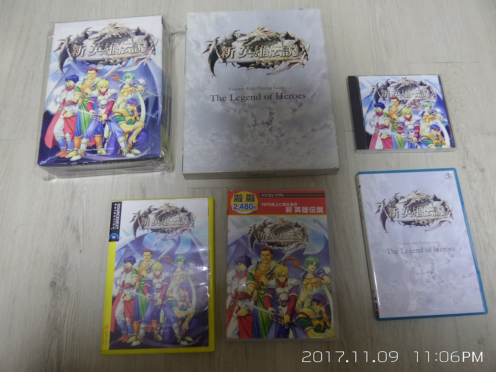
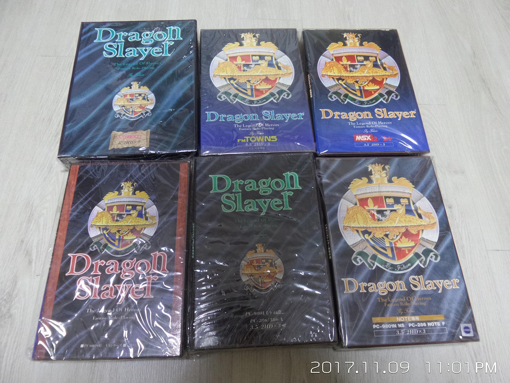
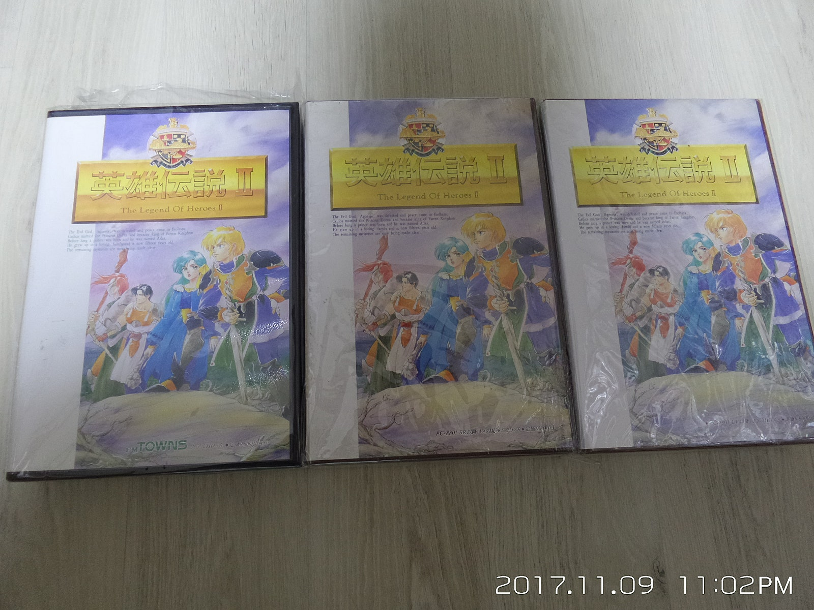
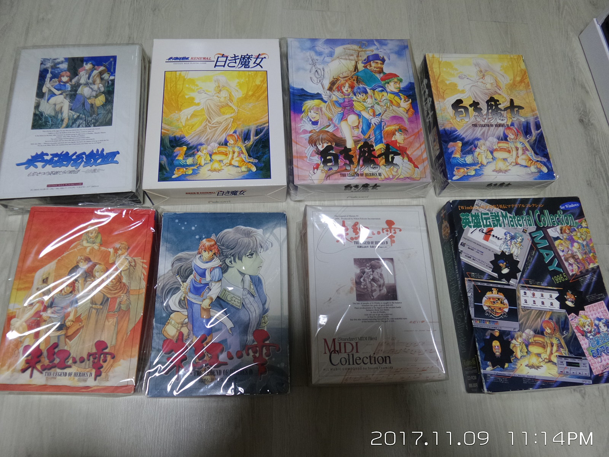

# 영웅전설 시리즈 한글패치 프로젝트

팔콤 『영웅전설』(드래곤 슬레이어 계보) 시리즈의 플랫폼별 한글 번역 패치를 만드는 프로젝트입니다. 리버싱·도구 제작에 Claude Code를 활용하고, AI 번역 + 인간 검수를 거칩니다.

패치 파일에는 원본 게임 데이터가 포함되지 않습니다. 적용하려면 직접 소장한 원본 이미지가 필요합니다.

## 패치 현황

| 게임         | 플랫폼           | 상태              | 다운로드 |
| ------------ | ---------------- | ----------------- | -------- |
| 영웅전설 1+2 | PS1 (SLPS-01323) | 🔧 리버싱 진행 중 | -        |

완성된 패치는 [Releases](../../releases)에 플랫폼별 태그(`ps1-ed1+2-v1.0.0` 형식)로 배포됩니다.
진행 계획과 마일스톤은 [ROADMAP.md](ROADMAP.md) 참조.

## 저장소 구조

```
games/       게임별 패처 코드베이스 (추출·재삽입·빌드 도구 + 리버싱 노트)
shared/      플랫폼 공용 라이브러리 (SJIS 스캔, ISO9660, 폰트 변환 등)
docs/        스크린샷, 패치 적용 가이드
vendor/      로컬 서드파티 (gitignore — emucap 빌드용, 아래 참조)
```

- [games/ps1-ed1+2](games/ps1-ed1+2/) — PS1 영웅전설 1+2

### 서드파티 도구

**create-kr-patch** — 한글 패치 제작 방법론 Agent Skill (추출·재삽입 전략,
라운드트립 규약의 단일 진실 원천). Claude Code 플러그인이며 **이 리포의
`.claude/settings.json`에 프로젝트 스코프로 선언**돼 있다(마켓플레이스 + 활성화).
따라서 이 리포에서만 로드되고 git으로 따라간다 — 다른 PC에서 리포를 처음 열면
Claude Code가 설치를 물어보므로 승인하면 된다(수동은 아래 한 줄).

```
claude plugin install create-kr-patch@kr-patch    # 자동 프롬프트 대신 수동 설치 시
```

**emucap** — 에뮬레이터 관찰·제어 MCP (메모리·화면·입력·브레이크포인트, 패치
디버깅·QA 자동화). Rust 빌드가 필요해 플러그인화 불가 — 클론 후 빌드해 등록한다:

```
git clone https://github.com/mcpads/emucap vendor/emucap
cd vendor/emucap && cargo build --release \
  --bin emucap --bin emucap-mcp --bin emucap-track-mcp --bin emucap-broker --bin emucap-mame-pc98-bridge
claude mcp add emucap-control -- "$(pwd)/target/release/emucap-mcp"
claude mcp add emucap-track   -- "$(pwd)/target/release/emucap-track-mcp"
```

PSX 검증은 Mednafen 포크 어댑터를 쓴다(`adapters/mednafen/build.sh`, BIOS
`scph5500.bin` → `~/.mednafen/firmware/`). BIOS·에뮬레이터 바이너리·원본은 커밋 금지.

## 소장 컬렉션

이 프로젝트는 아래 소장 원본을 기준으로 진행하며, 정발판(만트라)의 공식 번역을 번역 저본으로 사용합니다.

|                                                       |                                                       |                                                        |
| ----------------------------------------------------- | ----------------------------------------------------- | ------------------------------------------------------ |
|   |      |     |
| 정발 영웅전설 시리즈                                  | SFC · 메가드라이브 · PCE-CD · 새턴 · PS1              | 신 영웅전설 — Windows                                  |
|   |  |  |
| 영웅전설 I — X68000 · FM TOWNS · MSX2 · PC-88 · PC-98 | 영웅전설 II — FM TOWNS · PC-88 · PC-98                | 영웅전설 III · IV — PC-98                              |

## 고지

- 본 프로젝트는 **비영리 팬 번역 프로젝트**이며, 원작에 대한 어떠한 권리도 주장하지 않습니다.
- 『영웅전설』 시리즈의 저작권을 비롯한 모든 권리는 **Nihon Falcom Corporation** 및 각 권리자에게
  있습니다. 번역 저본으로 삼는 국내 정발판의 번역 문안 역시 해당 권리자에게 권리가 있습니다.
- 패치는 **차분(패치) 파일로만 배포**하며, 게임 원본 데이터·실행 파일·BIOS를 일절 포함하지
  않습니다. 적용에는 본인이 직접 소장한 원본 이미지가 필요합니다.
- 패치의 판매·유료 배포 등 **상업적 이용을 금지**합니다.
- 권리자의 요청이 있을 경우 배포를 즉시 중단합니다.

## 크레딧

- 리버싱·도구: Claude Code 보조
- 번역: 정발판(만트라) 공식 번역 이식 + AI 번역 + 인간 QA
- 폰트: [Galmuri](https://github.com/quiple/galmuri)(Lee Minseo) ·
  [Neo둥근모](https://github.com/neodgm/neodgm)(Eunbin Jeong) — SIL OFL 1.1, 라이선스 전문 `shared/fonts/`
